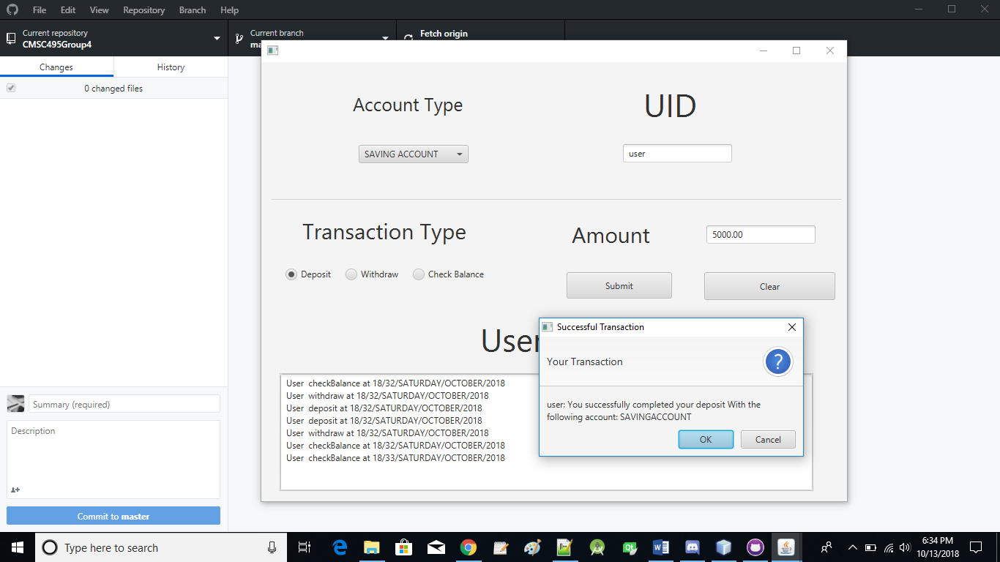

UMUC CMSC 495 Group 4 group project repository

Members:
Shanea King-Roberson, Darian Lopez, Sierra Council, and James Bertino

Project:
A desktop based application to keep tracks of money in checking and saving accounts and the interest earned in each account.

# JavaFXML Bank system with backend.

